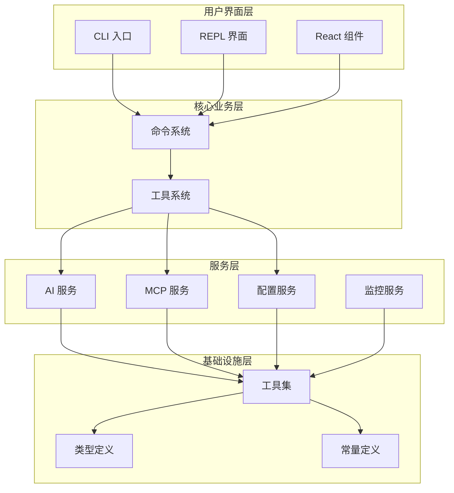
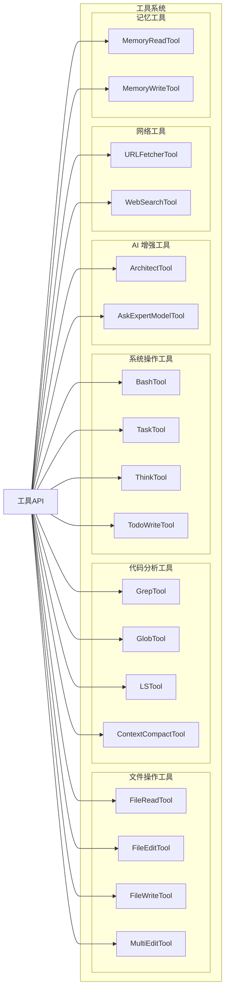
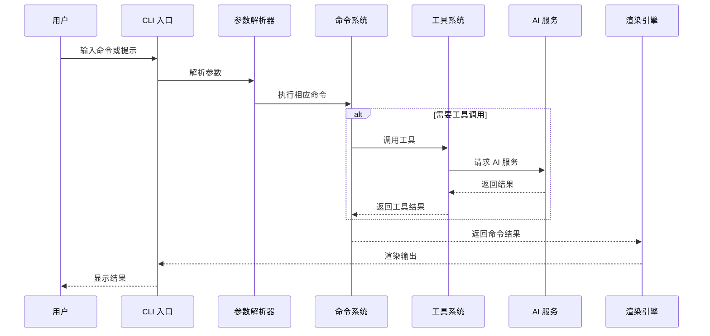
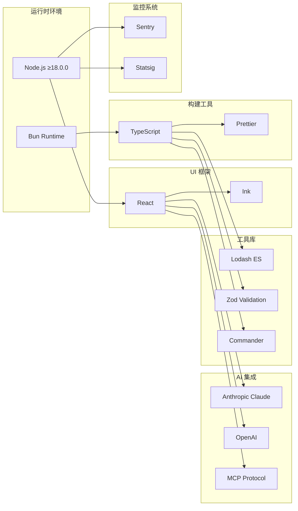
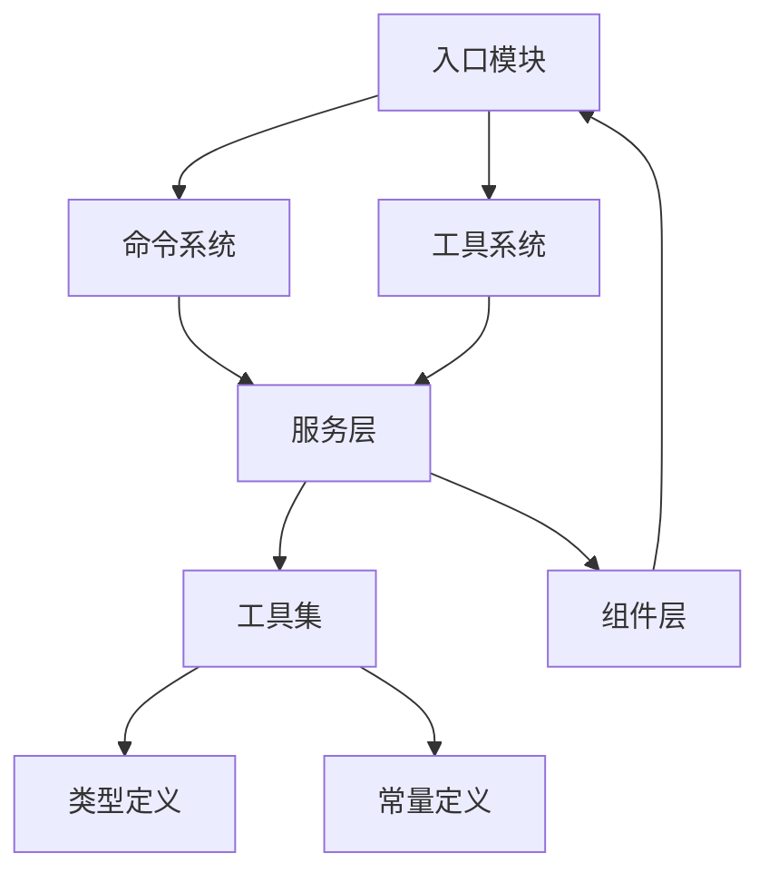

# Kode 架构图

## 整体架构图

```mermaid
graph TB
    subgraph "用户界面层"
        CLI[CLI 入口]
        REPL[REPL 界面]
        Components[React 组件]
    end
    
    subgraph "核心业务层"
        Commands[命令系统]
        Tools[工具系统]
    end
    
    subgraph "服务层"
        AIServices[AI 服务]
        MCPServices[MCP 服务]
        ConfigServices[配置服务]
        MonitorServices[监控服务]
    end
    
    subgraph "基础设施层"
        Utils[工具集]
        Types[类型定义]
        Constants[常量定义]
    end
    
    CLI --> Commands
    REPL --> Commands
    Components --> Commands
    
    Commands --> Tools
    
    Tools --> AIServices
    Tools --> MCPServices
    Tools --> ConfigServices
    
    AIServices --> Utils
    MCPServices --> Utils
    ConfigServices --> Utils
    MonitorServices --> Utils
    
    Utils --> Types
    Utils --> Constants
```

## 工具系统架构图

```mermaid
graph LR
    subgraph "工具系统"
        subgraph "文件操作工具"
            FileRead[FileReadTool]
            FileEdit[FileEditTool]
            FileWrite[FileWriteTool]
            MultiEdit[MultiEditTool]
        end
        
        subgraph "代码分析工具"
            Grep[GrepTool]
            Glob[GlobTool]
            LS[LSTool]
            ContextCompact[ContextCompactTool]
        end
        
        subgraph "系统操作工具"
            Bash[BashTool]
            Task[TaskTool]
            Think[ThinkTool]
            Todo[TodoWriteTool]
        end
        
        subgraph "AI 增强工具"
            Architect[ArchitectTool]
            AskExpert[AskExpertModelTool]
        end
        
        subgraph "网络工具"
            URLFetch[URLFetcherTool]
            WebSearch[WebSearchTool]
        end
        
        subgraph "记忆工具"
            MemoryRead[MemoryReadTool]
            MemoryWrite[MemoryWriteTool]
        end
    end
    
    ToolsAPI[工具API] --> FileRead
    ToolsAPI --> FileEdit
    ToolsAPI --> FileWrite
    ToolsAPI --> MultiEdit
    ToolsAPI --> Grep
    ToolsAPI --> Glob
    ToolsAPI --> LS
    ToolsAPI --> ContextCompact
    ToolsAPI --> Bash
    ToolsAPI --> Task
    ToolsAPI --> Think
    ToolsAPI --> Todo
    ToolsAPI --> Architect
    ToolsAPI --> AskExpert
    ToolsAPI --> URLFetch
    ToolsAPI --> WebSearch
    ToolsAPI --> MemoryRead
    ToolsAPI --> MemoryWrite
```

## 命令系统架构图

```mermaid
graph TB
    subgraph "命令系统"
        subgraph "配置管理"
            Config[config]
            ConfigCmd[config-cmd]
            Model[model]
            ModelStatus[modelstatus]
        end
        
        subgraph "开发辅助"
            Bug[bug]
            Review[review]
            TodoCmd[todo]
            Doctor[doctor]
            ContextCmd[context]
        end
        
        subgraph "身份验证"
            Login[login]
            Logout[logout]
        end
        
        subgraph "系统工具"
            Clear[clear]
            Compact[compact]
            Exit[exit]
            Quit[quit]
            Ignore[ignore]
        end
        
        subgraph "高级功能"
            MCP[mcp]
            Agents[agents]
            KiroSpec[kiro-spec]
            TerminalSetup[terminalSetup]
        end
        
        subgraph "内部命令"
            CtxViz[ctx_viz]
            Resume[resume]
            Listen[listen]
        end
    end
    
    CommandRegistry[命令注册表] --> Config
    CommandRegistry --> ConfigCmd
    CommandRegistry --> Model
    CommandRegistry --> ModelStatus
    CommandRegistry --> Bug
    CommandRegistry --> Review
    CommandRegistry --> TodoCmd
    CommandRegistry --> Doctor
    CommandRegistry --> ContextCmd
    CommandRegistry --> Login
    CommandRegistry --> Logout
    CommandRegistry --> Clear
    CommandRegistry --> Compact
    CommandRegistry --> Exit
    CommandRegistry --> Quit
    CommandRegistry --> Ignore
    CommandRegistry --> MCP
    CommandRegistry --> Agents
    CommandRegistry --> KiroSpec
    CommandRegistry --> TerminalSetup
    CommandRegistry --> CtxViz
    CommandRegistry --> Resume
    CommandRegistry --> Listen
```

## 数据流架构图

```mermaid
sequenceDiagram
    participant User as 用户
    participant CLI as CLI 入口
    participant Parser as 参数解析器
    participant Command as 命令系统
    participant Tool as 工具系统
    participant AI as AI 服务
    participant Render as 渲染引擎
    
    User->>CLI: 输入命令或提示
    CLI->>Parser: 解析参数
    Parser->>Command: 执行相应命令
    
    alt 需要工具调用
        Command->>Tool: 调用工具
        Tool->>AI: 请求 AI 服务
        AI-->>Tool: 返回结果
        Tool-->>Command: 返回工具结果
    end
    
    Command-->>Render: 返回命令结果
    Render-->>CLI: 渲染输出
    CLI-->>User: 显示结果
```

## 技术栈架构图

```mermaid
graph LR
    subgraph "运行时环境"
        NodeJS[Node.js ≥18.0.0]
        Bun[Bun Runtime]
    end
    
    subgraph "UI 框架"
        React[React]
        Ink[Ink]
    end
    
    subgraph "构建工具"
        TypeScript[TypeScript]
        Prettier[Prettier]
    end
    
    subgraph "AI 集成"
        Anthropic[Anthropic Claude]
        OpenAI[OpenAI]
        MCP[MCP Protocol]
    end
    
    subgraph "监控系统"
        Sentry[Sentry]
        Statsig[Statsig]
    end
    
    subgraph "工具库"
        Lodash[Lodash ES]
        Zod[Zod Validation]
        Commander[Commander]
    end
    
    NodeJS --> React
    React --> Ink
    Bun --> TypeScript
    TypeScript --> Prettier
    
    React --> Anthropic
    React --> OpenAI
    React --> MCP
    
    NodeJS --> Sentry
    NodeJS --> Statsig
    
    TypeScript --> Lodash
    TypeScript --> Zod
    TypeScript --> Commander
```

## 模块依赖关系图

```mermaid
graph TD
    Entrypoints[入口模块] --> Commands[命令系统]
    Entrypoints --> Tools[工具系统]
    
    Commands --> Services[服务层]
    Tools --> Services
    
    Services --> Utils[工具集]
    Services --> Components[组件层]
    
    Utils --> Types[类型定义]
    Utils --> Constants[常量定义]
    
    Components --> Entrypoints
```

这些架构图展示了 Kode 项目的整体结构、模块划分、数据流和技术栈，帮助开发者理解项目的设计理念和实现细节。