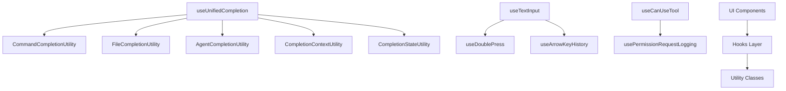

# Hooks 层架构文档

## 概述
Hooks 层是 Kode TUI 应用的状态管理和业务逻辑核心，提供了可复用的 React Hook 组件，涵盖自动补全、权限控制、输入处理、工具使用等多个功能模块。

## 模块分类

### 1. 自动补全模块 (completion/)

#### CommandCompletionUtility
- **功能**: 命令自动补全工具类
- **特性**:
  - 系统命令扫描和加载
  - 命令智能分类（core/common/dev/system）
  - 子命令建议生成
  - Unix 命令模糊匹配

#### FileCompletionUtility  
- **功能**: 文件路径自动补全工具类
- **特性**: 文件系统扫描、路径建议生成、目录识别

#### AgentCompletionUtility
- **功能**: Agent 提及自动补全工具类
- **特性**: Agent 和模型提及建议生成

#### CompletionContextUtility
- **功能**: 补全上下文分析工具类
- **特性**: 输入上下文解析、补全类型判断

#### CompletionStateUtility
- **功能**: 补全状态管理工具类
- **特性**: 补全状态维护、建议列表管理

#### useUnifiedCompletion
- **功能**: 统一自动补全 Hook
- **特性**: 集成所有补全工具、智能建议排序、上下文感知补全

#### useSubcommandCompletion
- **功能**: 子命令补全触发 Hook
- **特性**: 子命令补全检测、外部系统集成接口

### 2. 输入处理模块

#### useTextInput
- **功能**: 文本输入处理核心 Hook
- **特性**:
  - 多行文本输入支持
  - 快捷键处理（Ctrl+C, Ctrl+D, Ctrl+V 等）
  - 图像粘贴支持
  - 光标移动和编辑操作

#### useArrowKeyHistory
- **功能**: 方向键历史记录导航
- **特性**: 输入历史记录管理、上下导航

### 3. 权限控制模块

#### useCanUseTool
- **功能**: 工具使用权限检查 Hook
- **特性**: 工具权限验证、用户确认提示、权限日志记录

#### usePermissionRequestLogging
- **功能**: 权限请求日志记录 Hook
- **特性**: 权限请求事件跟踪、使用统计

### 4. 工具使用模块

#### useCancelRequest
- **功能**: 请求取消处理 Hook
- **特性**: 异步请求中止控制、取消事件处理

#### useDoublePress
- **功能**: 双击检测 Hook
- **特性**: 双击事件识别、自定义双击处理

### 5. 系统工具模块

#### useTerminalSize
- **功能**: 终端尺寸响应式 Hook
- **特性**: 全局终端尺寸监听、跨组件尺寸共享

#### useExitOnCtrlCD
- **功能**: Ctrl+C 退出处理 Hook
- **特性**: 退出信号捕获、优雅退出处理

#### useInterval
- **功能**: 定时器 Hook
- **特性**: 可配置间隔定时、自动清理

### 6. API 集成模块

#### useApiKeyVerification
- **功能**: API 密钥验证 Hook
- **特性**: 密钥有效性检查、错误状态管理、重新验证支持

#### useLogMessages
- **功能**: 消息日志记录 Hook
- **特性**: 消息事件记录、日志输出控制

#### useLogStartupTime
- **功能**: 启动时间记录 Hook
- **特性**: 启动性能监控、时间统计

### 7. 辅助工具模块

#### useNotifyAfterTimeout
- **功能**: 超时通知 Hook
- **特性**: 延迟通知显示、超时处理

#### useSubcommandRegistry
- **功能**: 子命令注册表 Hook
- **特性**: 子命令注册管理、命令发现

## 架构特点

### 1. 分层设计
- **工具类层**: 独立的业务逻辑工具类（CompletionUtility）
- **Hook 层**: React Hook 封装，提供组件接口
- **集成层**: 统一集成 Hook（useUnifiedCompletion）

### 2. 模块化架构
- 每个功能模块独立封装
- 清晰的职责分离
- 易于测试和维护

### 3. 状态管理
- 使用 React useState/useEffect 管理局部状态
- 全局状态通过 Context 或自定义 Hook 共享
- 异步操作使用 Promise 和 AbortController

### 4. 错误处理
- 统一的错误处理机制
- 优雅的降级处理
- 详细的错误日志记录

## 依赖关系

## 扩展指南

### 添加新的补全类型
1. 在 `completion/types.ts` 中定义新的补全类型
2. 创建对应的 CompletionUtility 类
3. 在 `useUnifiedCompletion` 中集成新的补全逻辑

### 添加新的输入处理
1. 在 `useTextInput` 中添加新的输入处理逻辑
2. 或者创建独立的输入处理 Hook

### 添加权限控制
1. 使用 `useCanUseTool` 作为基础
2. 在权限配置中添加新的工具权限规则

## 相关链接

- [TUI 总体架构](../tui/overview.md)
- [TUI 组件文档](../tui/components.md)
- [工具系统架构](../tools/overview.md)