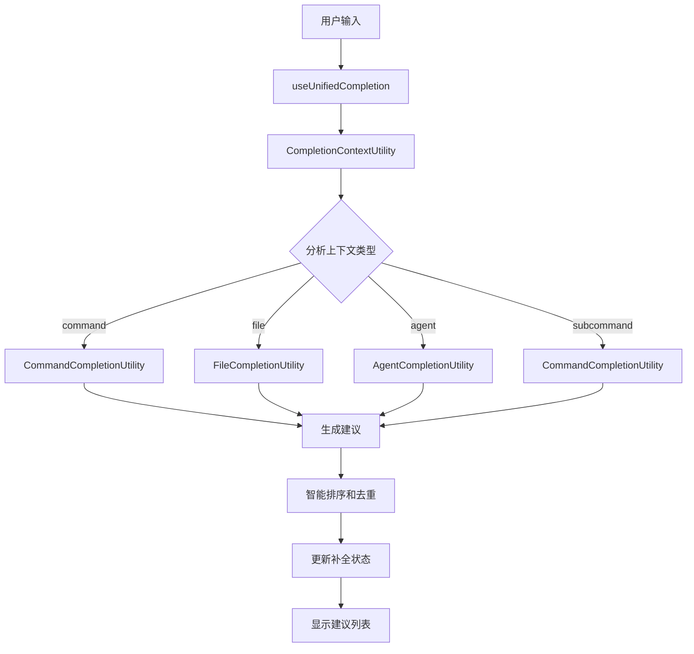

# 自动补全模块详细文档

## 模块概述
自动补全模块是 Kode TUI 的核心功能之一，提供了智能的输入补全建议系统，支持命令、文件、Agent 提及等多种补全类型。

## 核心组件

### 1. CommandCompletionUtility

#### 功能特性
- **系统命令扫描**: 自动扫描 PATH 环境变量中的可执行文件
- **命令智能分类**: 基于多维度特征分析将命令分为 core/common/dev/system 四类
- **子命令建议**: 支持子命令的自动补全和建议生成
- **模糊匹配**: 使用模糊匹配算法提供智能建议

#### 分类算法
```typescript
private classifyCommand(cmd: string): 'core' | 'common' | 'dev' | 'system' {
  // 基于名称长度、字符模式、语言模式等多维度特征评分
  // 总分 >= 50: core, >= 20: common, >= -10: dev, 其他: system
}
```

#### 使用示例
```typescript
const utility = new CommandCompletionUtility()
const suggestions = utility.generateCommandSuggestions('git', commands)
```

### 2. FileCompletionUtility

#### 功能特性
- **文件系统扫描**: 实时扫描当前目录和子目录
- **路径建议**: 提供文件和目录的路径补全建议
- **智能过滤**: 根据输入前缀智能过滤建议
- **目录识别**: 自动识别目录并添加斜杠

### 3. AgentCompletionUtility

#### 功能特性
- **Agent 提及**: 支持 @ 提及 Agent 和模型的补全
- **模型识别**: 识别和补全支持的模型名称
- **智能匹配**: 即使没有 @ 符号也能智能匹配 Agent

### 4. CompletionContextUtility

#### 功能特性
- **上下文分析**: 分析输入文本的上下文环境
- **补全类型判断**: 判断当前需要哪种类型的补全（command/file/agent）
- **位置解析**: 解析光标位置和补全起始位置

#### 支持的补全类型
- `command`: 斜杠命令补全
- `subcommand`: 子命令补全  
- `agent`: Agent 提及补全
- `file`: 文件和路径补全

### 5. CompletionStateUtility

#### 功能特性
- **状态管理**: 管理补全系统的状态（激活状态、选中索引等）
- **建议列表维护**: 维护当前的建议列表和选中状态
- **预览管理**: 管理补全预览功能

### 6. useUnifiedCompletion Hook

#### 核心功能
```typescript
export function useUnifiedCompletion({
  input,           // 当前输入值
  cursorOffset,    // 光标偏移量
  onInputChange,   // 输入变化回调
  setCursorOffset, // 设置光标偏移量
  commands,        // 可用命令列表
  onSubmit,        // 提交回调
}: Props)
```

#### 工作流程
1. **上下文分析**: 使用 CompletionContextUtility 分析当前输入上下文
2. **建议生成**: 根据上下文类型调用对应的 CompletionUtility 生成建议
3. **智能排序**: 对不同来源的建议进行加权排序和去重
4. **状态更新**: 更新补全状态和界面显示

#### 智能排序算法
```typescript
// 不同来源的建议具有不同的权重
const weightedSuggestions = [
  ...unixSuggestions.map(s => ({ ...s, weightedScore: s.score + 200 })),
  ...mentionMatches.map(s => ({ ...s, weightedScore: s.score + 50 })),
  ...fileSuggestions.map(s => ({ ...s, weightedScore: s.score }))
]
```

### 7. useSubcommandCompletion Hook

#### 功能特性
- **子命令检测**: 检测 `/command ` 模式触发子命令补全
- **外部集成**: 提供外部系统集成接口
- **条件检查**: 检查命令是否具有子命令

#### 接口定义
```typescript
interface SubcommandCompletionHookOptions {
  onTrigger?: (commandName: string, input: string, cursorOffset: number) => boolean
  hasSubcommands?: (commandName: string) => boolean
}
```

## 数据流架构



## 配置选项

### 全局配置
```typescript
// 从全局配置获取补全选项
const config = getGlobalConfig()
const limit = config.completionItemsLimit || 15 // 建议项数量限制
```

### 性能优化
- **懒加载**: 系统命令按需加载
- **缓存**: 使用内存缓存提高性能
- **去重**: 建议列表自动去重
- **限制**: 限制返回的建议数量

## 扩展指南

### 添加新的补全类型
1. 在 `completion/types.ts` 中定义新的补全类型
2. 创建对应的 CompletionUtility 类实现补全逻辑
3. 在 `useUnifiedCompletion` 的 `generateSuggestions` 方法中添加新的 case
4. 在 `CompletionContextUtility` 中添加新的上下文分析逻辑

### 自定义排序算法
可以重写 `useUnifiedCompletion` 中的排序逻辑来自定义建议的优先级：

```typescript
// 自定义权重分配
const customWeightedSuggestions = [
  ...suggestions.map(s => ({
    ...s,
    weightedScore: calculateCustomScore(s)
  }))
]
```

## 错误处理

### 加载错误
- 系统命令加载失败时使用备用命令列表
- 文件扫描错误时返回空建议列表
- 网络请求错误时提供友好的错误提示

### 边界情况
- 空输入处理
- 无效路径处理
- 权限不足的处理

## 相关链接

- [Hooks 层总览](../README.md)
- [TUI 组件文档](../tui/components.md)
- [工具系统架构](../tools/overview.md)