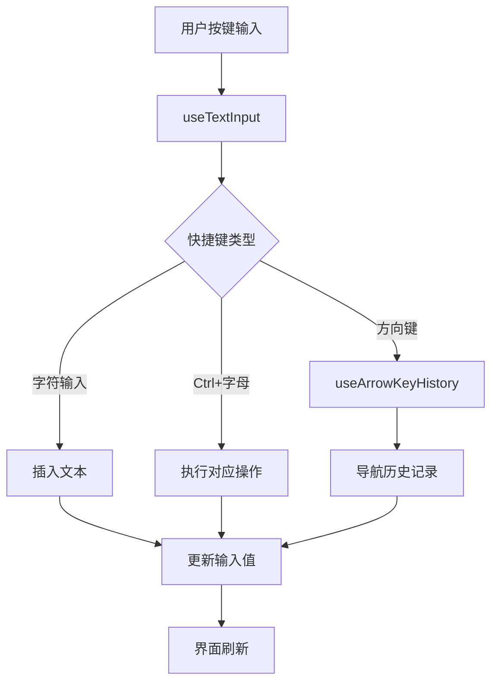
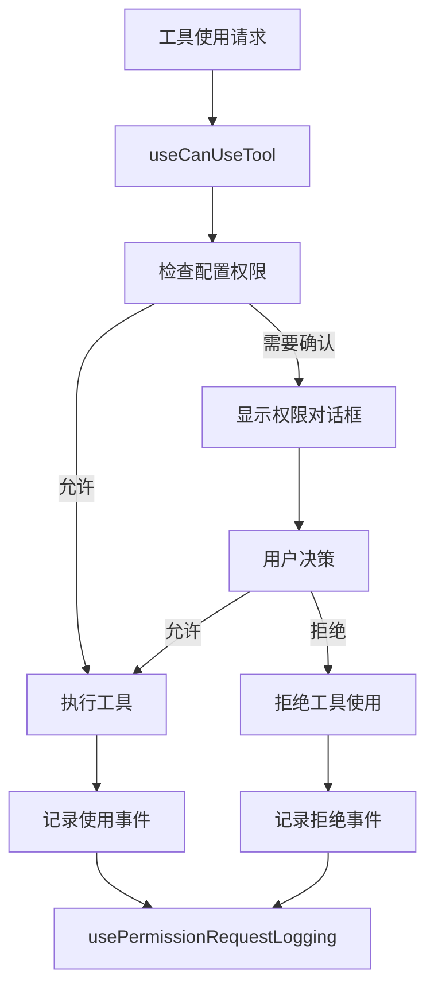

# 输入处理与权限控制模块文档

## 模块概述
输入处理与权限控制模块负责管理用户输入交互和工具使用权限验证，是 TUI 应用的核心交互层。

## 输入处理组件

### 1. useTextInput Hook

#### 核心功能
- **多行文本输入**: 支持多行文本编辑和换行处理
- **快捷键支持**: 完整的终端快捷键支持（Ctrl+A, Ctrl+E, Ctrl+K 等）
- **图像粘贴**: 支持从剪贴板粘贴图像
- **光标控制**: 精确的光标移动和编辑操作

#### 快捷键映射
```typescript
const handleCtrl = mapInput([
  ['a', () => cursor.startOfLine()],      // 移动到行首
  ['b', () => cursor.left()],            // 向左移动
  ['c', handleCtrlC],                    // Ctrl+C 处理
  ['d', handleCtrlD],                    // Ctrl+D 处理
  ['e', () => cursor.endOfLine()],       // 移动到行尾
  ['f', () => cursor.right()],           // 向右移动
  ['h', () => cursor.backspace()],       // 退格删除
  ['k', () => cursor.deleteToLineEnd()], // 删除到行尾
  ['l', () => clear()],                  // 清屏
  ['n', () => downOrHistoryDown()],      // 向下移动或历史记录
  ['p', () => upOrHistoryUp()],          // 向上移动或历史记录
  ['u', () => cursor.deleteToLineStart()], // 删除到行首
  ['v', tryImagePaste],                  // 粘贴图像
  ['w', () => cursor.deleteWordBefore()], // 删除前一个单词
])
```

#### 图像粘贴功能
```typescript
function tryImagePaste() {
  const base64Image = getImageFromClipboard()
  if (base64Image) {
    onImagePaste?.(base64Image)
    return cursor.insert('[Image pasted]')
  }
  // 错误处理...
}
```

### 2. useArrowKeyHistory Hook

#### 功能特性
- **历史记录管理**: 维护输入历史记录堆栈
- **导航控制**: 使用上下箭头键导航历史记录
- **状态重置**: 输入提交后重置历史记录指针

#### 使用场景
- 命令历史记录浏览
- 输入内容快速重用
- 错误命令修正

## 权限控制组件

### 1. useCanUseTool Hook

#### 核心功能
- **权限验证**: 检查工具使用权限配置
- **用户确认**: 显示权限请求确认对话框
- **结果处理**: 处理用户允许或拒绝权限请求

#### 权限检查流程
```typescript
async function checkToolPermission(
  tool: ToolType,
  input: any,
  context: ToolUseContext,
  message: AssistantMessage
): Promise<PermissionResult> {
  // 1. 检查配置权限
  const configResult = await hasPermissionsToUseTool(tool, input, context, message)
  if (configResult.result) {
    return { result: true } // 配置允许
  }
  
  // 2. 向用户请求确认
  return new Promise(resolve => {
    setToolUseConfirm({
      // 对话框配置...
      onAllow: () => resolve({ result: true }),
      onReject: () => resolve({ result: false, message: REJECT_MESSAGE })
    })
  })
}
```

#### 权限请求对话框
- **工具描述**: 显示工具功能描述
- **风险评分**: 显示工具使用风险评分（可选）
- **操作选项**: 提供允许、临时允许、拒绝等选项
- **取消处理**: 支持 Ctrl+C 取消请求

### 2. usePermissionRequestLogging Hook

#### 功能特性
- **事件记录**: 记录所有权限请求事件
- **使用统计**: 统计工具使用频率和模式
- **错误跟踪**: 记录权限验证错误信息

#### 记录的事件类型
- `tengu_tool_use_granted_in_config`: 配置允许的工具使用
- `tengu_tool_use_granted_in_prompt_permanent`: 用户永久允许
- `tengu_tool_use_granted_in_prompt_temporary`: 用户临时允许  
- `tengu_tool_use_rejected_in_prompt`: 用户拒绝使用
- `tengu_tool_use_cancelled`: 用户取消请求

## 数据流架构

### 输入处理数据流


### 权限控制数据流


## 配置和自定义

### 输入配置选项
```typescript
type UseTextInputProps = {
  value: string                    // 当前输入值
  onChange: (value: string) => void // 输入变化回调
  onSubmit?: (value: string) => void // 提交回调
  onExit?: () => void              // 退出回调
  multiline?: boolean              // 是否多行模式
  mask?: string                    // 输入掩码
  // ...其他选项
}
```

### 权限配置
权限配置通过全局权限系统管理，支持：
- **工具级别权限**: 为每个工具设置独立的权限规则
- **用户级别权限**: 基于用户身份的权限控制  
- **上下文权限**: 基于使用上下文的动态权限控制

## 错误处理

### 输入错误处理
- **图像粘贴错误**: 显示友好的错误消息
- **快捷键冲突**: 避免快捷键功能冲突
- **内存溢出**: 限制历史记录大小防止内存溢出

### 权限错误处理  
- **配置错误**: 权限配置解析错误处理
- **网络错误**: 远程权限验证网络错误处理
- **用户取消**: 优雅处理用户取消操作

## 性能优化

### 输入性能
- **防抖处理**: 减少频繁的界面刷新
- **懒加载**: 图像粘贴按需加载
- **内存管理**: 合理管理历史记录内存使用

### 权限性能
- **缓存机制**: 权限检查结果缓存
- **批量处理**: 批量权限验证优化
- **异步处理**: 非阻塞的权限验证操作

## 扩展指南

### 添加新的快捷键
1. 在 `useTextInput` 的 `handleCtrl` 或 `handleMeta` 映射中添加新的快捷键处理
2. 实现对应的处理函数
3. 更新类型定义和文档

### 自定义权限对话框
可以重写 `useCanUseTool` 中的对话框显示逻辑：

```typescript
setToolUseConfirm({
  assistantMessage,
  tool,
  description,
  input,
  // 自定义对话框配置...
})
```

## 相关链接

- [Hooks 层总览](../README.md)
- [自动补全模块](./completion-module.md)
- [工具系统架构](../tools/overview.md)