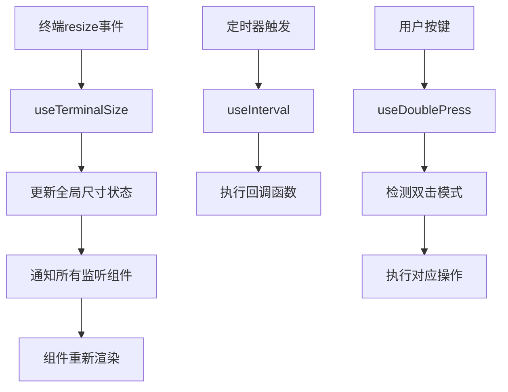
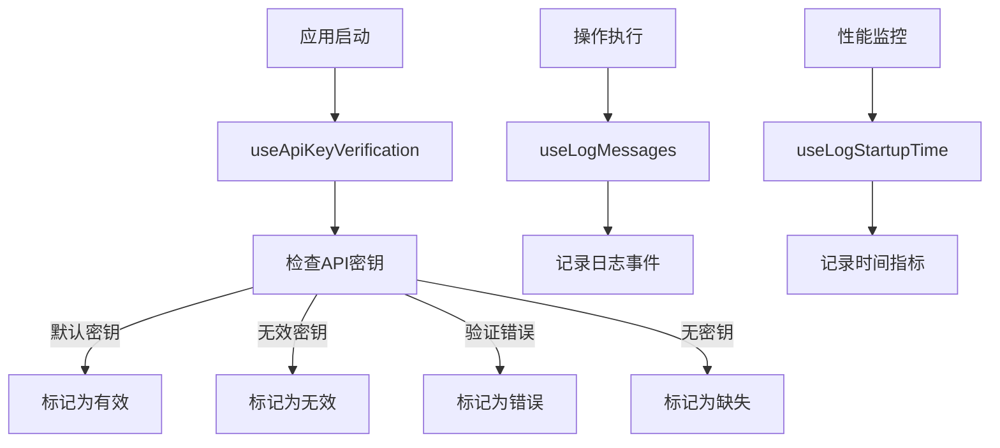

# 系统工具与 API 集成模块文档

## 模块概述
系统工具与 API 集成模块提供基础设施级别的功能支持，包括终端管理、定时任务、API 集成和日志记录等核心功能。

## 系统工具组件

### 1. useTerminalSize Hook

#### 核心功能
- **响应式尺寸监听**: 实时监听终端窗口尺寸变化
- **全局状态共享**: 跨组件共享终端尺寸信息
- **性能优化**: 单一全局监听器，避免重复绑定

#### 实现原理
```typescript
// 全局状态共享
let globalSize = { columns: 80, rows: 24 }
const listeners = new Set<() => void>()

function updateAllListeners() {
  globalSize = { columns: process.stdout.columns, rows: process.stdout.rows }
  listeners.forEach(listener => listener()) // 通知所有监听组件
}
```

#### 使用示例
```typescript
const { columns, rows } = useTerminalSize()
// 根据终端尺寸动态调整UI布局
```

### 2. useExitOnCtrlCD Hook

#### 功能特性
- **信号捕获**: 捕获 Ctrl+C 退出信号
- **优雅退出**: 提供自定义退出处理逻辑
- **防止误操作**: 支持双击确认退出

#### 使用场景
- 命令行工具的安全退出
- 数据保存和资源清理
- 用户确认退出操作

### 3. useInterval Hook

#### 功能特性
- **可配置定时器**: 支持自定义时间间隔
- **自动清理**: 组件卸载时自动清除定时器
- **动态调整**: 支持运行时调整间隔时间

#### 实现示例
```typescript
function useInterval(callback: () => void, delay: number | null) {
  const savedCallback = useRef(callback)
  
  useEffect(() => {
    savedCallback.current = callback
  }, [callback])
  
  useEffect(() => {
    if (delay !== null) {
      const id = setInterval(() => savedCallback.current(), delay)
      return () => clearInterval(id) // 自动清理
    }
  }, [delay])
}
```

### 4. useDoublePress Hook

#### 功能特性
- **双击检测**: 精确的双击事件识别
- **超时处理**: 支持自定义双击时间阈值
- **多用途**: 支持多种双击场景（退出、清除等）

#### 使用示例
```typescript
const handleCtrlC = useDoublePress(
  show => onExitMessage?.(show, 'Ctrl-C'), // 第一次按下
  () => onExit?(),                         // 第二次按下（退出）
  () => onChange('')                        // 超时处理
)
```

## API 集成组件

### 1. useApiKeyVerification Hook

#### 核心功能
- **密钥验证**: 验证 Anthropic API 密钥的有效性
- **状态管理**: 管理验证状态（loading/valid/invalid/missing/error）
- **错误处理**: 提供详细的错误信息和重试机制

#### 验证逻辑
```typescript
function isDefaultApiKey(apiKey: string | null): boolean {
  // 默认密钥模式识别（用于演示和测试）
  return apiKey?.startsWith('sk-ant-') && apiKey.length <= 20
}

async function verifyApiKey(apiKey: string): Promise<boolean> {
  // 调用 Anthropic API 验证密钥有效性
}
```

#### 状态管理
- `loading`: 验证进行中
- `valid`: 密钥有效
- `invalid`: 密钥无效
- `missing`: 密钥未提供
- `error`: 验证过程出错

### 2. useLogMessages Hook

#### 功能特性
- **消息记录**: 记录应用运行时的消息事件
- **分类处理**: 支持不同级别的日志消息
- **输出控制**: 控制日志输出格式和目标

#### 日志级别
- **信息消息**: 普通操作日志
- **警告消息**: 非关键性警告
- **错误消息**: 错误和异常记录
- **调试消息**: 开发调试信息

### 3. useLogStartupTime Hook

#### 功能特性
- **启动监控**: 记录应用启动时间
- **性能分析**: 分析启动性能瓶颈
- **优化指导**: 为性能优化提供数据支持

#### 监控指标
- **冷启动时间**: 从零开始的启动时间
- **热启动时间**: 缓存后的启动时间
- **模块加载时间**: 各模块加载耗时

## 辅助工具组件

### 1. useNotifyAfterTimeout Hook

#### 功能特性
- **延迟通知**: 在指定延迟后显示通知
- **超时处理**: 处理操作超时情况
- **用户反馈**: 提供操作状态反馈

#### 使用场景
- 长时间操作的进度提示
- 操作超时的错误提示
- 临时状态信息的显示

### 2. useSubcommandRegistry Hook

#### 功能特性
- **命令注册**: 管理子命令的注册信息
- **命令发现**: 提供命令发现和查询功能
- **元数据管理**: 管理命令的元数据信息

#### 注册接口
```typescript
interface SubcommandRegistry {
  registerCommand(command: SubcommandDefinition): void
  getCommand(name: string): SubcommandDefinition | undefined
  getAllCommands(): SubcommandDefinition[]
}
```

## 数据流架构

### 系统工具数据流


### API 集成数据流


## 配置和自定义

### 终端尺寸配置
```typescript
// 默认终端尺寸（当无法获取实际尺寸时使用）
const defaultSize = { columns: 80, rows: 24 }

// 最大监听器数量（防止内存泄漏）
process.stdout.setMaxListeners(20)
```

### API 验证配置
- **默认密钥识别**: 支持演示和测试用的默认密钥
- **验证超时**: 可配置的API验证超时时间
- **重试机制**: 验证失败时的重试策略

### 日志配置
- **日志级别**: 可配置的日志输出级别
- **输出格式**: 自定义日志消息格式
- **输出目标**: 控制台、文件、远程服务等输出目标

## 错误处理

### 系统错误处理
- **终端尺寸获取失败**: 使用默认尺寸降级处理
- **定时器异常**: 捕获并记录定时器执行错误
- **双击检测异常**: 处理时间计算错误

### API 错误处理
- **网络错误**: API 请求网络错误处理
- **验证失败**: 密钥验证失败的不同场景处理
- **服务不可用**: 后端服务不可用的降级处理

## 性能优化

### 系统性能
- **单一监听器**: 终端尺寸使用单一全局监听器
- **懒加载**: API 验证按需执行
- **内存优化**: 合理管理监听器和定时器资源

### 监控性能
- **轻量级监控**: 启动时间监控对性能影响最小化
- **采样率控制**: 可配置的监控数据采样率
- **数据压缩**: 监控数据的压缩和聚合

## 扩展指南

### 添加新的系统工具
1. 分析功能需求和使用场景
2. 设计 Hook 接口和状态管理
3. 实现核心功能逻辑
4. 添加错误处理和性能优化
5. 编写测试用例和文档

### 集成新的 API 服务
1. 定义 API 接口和数据类型
2. 实现 API 调用和错误处理
3. 设计状态管理机制
4. 提供配置选项和自定义扩展点

## 相关链接

- [Hooks 层总览](../README.md)
- [自动补全模块](./completion-module.md)
- [输入处理与权限控制模块](./input-permission-module.md)
- [工具系统架构](../tools/overview.md)