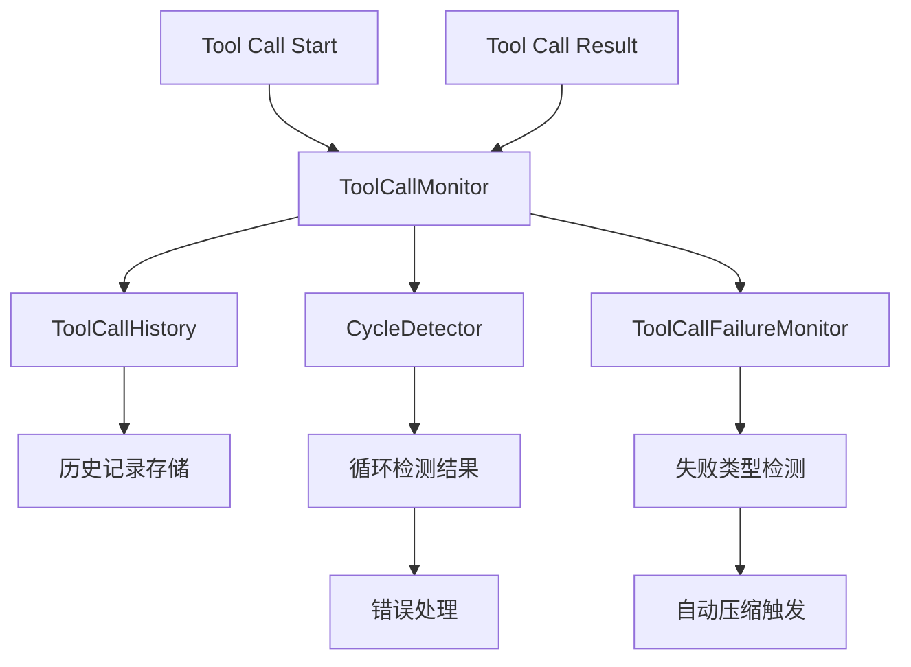

# Core Monitor 核心监控模块

## 概述

核心监控模块是监控系统的基础，提供工具调用监控、循环检测、历史记录管理等核心功能。

## 核心组件详解

### ToolCallMonitor - 工具调用监控器

#### 功能描述
主监控器，负责协调所有监控功能，提供完整的工具调用生命周期管理。

#### 主要方法
- **onToolCallStart(record: ToolCallRecord)**: 工具调用开始时调用
- **onToolCallResult(record: any)**: 工具调用结果时调用
- **enable()/disable()**: 启用/禁用监控
- **updateConfig(config)**: 更新配置
- **manualCycleCheck()**: 手动触发循环检测

#### 技术特点
- 事件驱动的监控架构
- 配置热更新支持
- 详细的日志记录系统
- 状态管理机制

### ToolCallHistory - 工具调用历史记录

#### 功能描述
管理工具调用历史记录，提供记录存储、查询和管理的功能。

#### 主要方法
- **add(record)**: 添加工具调用记录
- **getRecentSteps(count)**: 获取最近N步历史
- **getAll()**: 获取完整历史记录
- **findByName(name)**: 按名称查找记录
- **clear()**: 清空历史记录

#### 技术特点
- 固定长度的历史记录队列
- 深度比较的记录去重
- 灵活的查询接口
- 内存高效的存储机制

### CycleDetector - 循环检测器

#### 功能描述
检测工具调用历史中的循环模式，防止无限循环。

#### 主要方法
- **detectCycle(history, maxCycleSteps)**: 检测循环
- **getAllCycles(history, maxStep)**: 获取所有循环模式
- **hasPartialCycle(history, minSimilarity)**: 检查部分循环

#### 检测算法
1. **步长检测**: 从最大步长开始，逐步减小检测步长
2. **序列比较**: 比较历史记录中的序列模式
3. **相似度计算**: 支持部分相似性检测
4. **多重检测**: 支持检测多个不同步长的循环

#### 技术特点
- 多步长循环检测
- 深度对象比较
- 相似度阈值配置
- 高性能检测算法

## 数据流架构



## 配置选项

### 核心监控配置
```typescript
interface CoreMonitorConfig {
  maxCycleSteps: number;      // 最大循环检测步长
  maxHistorySteps: number;    // 最大历史记录步数
  enabled: boolean;           // 是否启用监控
  terminateOnCycle: boolean;  // 检测到循环时是否终止
  logLevel: string;           // 日志级别
}
```

### 默认配置值
- maxCycleSteps: 5
- maxHistorySteps: 10  
- enabled: true
- terminateOnCycle: true
- logLevel: 'warn'

## 错误处理

### ToolCallCycleError
循环检测错误，包含检测到的循环步长信息。

```typescript
class ToolCallCycleError extends Error {
  public readonly cycleLength: number;
  constructor(cycleLength: number);
}
```

### 错误处理流程
1. 检测到循环时抛出 ToolCallCycleError
2. 根据配置决定是否终止任务
3. 记录详细的错误日志
4. 提供错误恢复机制

## 性能优化

### 内存优化
- 固定长度的历史记录
- 对象引用共享
- 高效的比较算法

### 计算优化
- 增量式循环检测
- 缓存检测结果
- 异步配置操作

## 扩展指南

### 自定义循环检测算法
```typescript
class CustomCycleDetector extends CycleDetector {
  static detectCycle(history: ToolCallRecord[]): CycleDetectionResult {
    // 实现自定义检测逻辑
  }
}
```

### 集成新的监控功能
```typescript
class ExtendedToolCallMonitor extends ToolCallMonitor {
  onToolCallStart(record: ToolCallRecord) {
    super.onToolCallStart(record);
    // 添加自定义监控逻辑
  }
}
```

### 配置扩展
在 `MonitorConfig` 接口中添加新的配置选项，并在 `ConfigManager` 中实现配置验证和默认值处理。