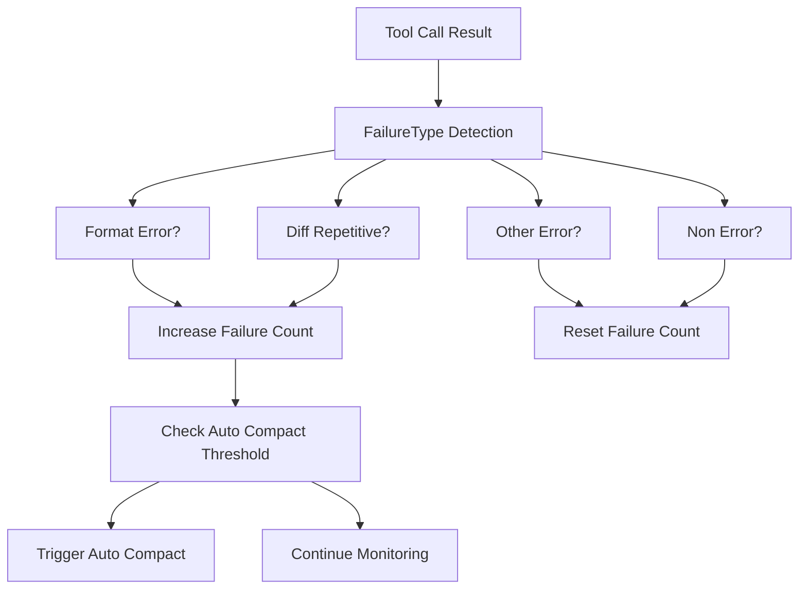

# Failure Monitor 失败监控模块

## 概述

失败监控模块专门负责检测和处理工具调用失败情况，通过智能失败类型识别和自动压缩机制，防止重复失败和系统资源浪费。

## 核心组件详解

### ToolCallFailureMonitor - 工具调用失败监控器

#### 功能描述
监控工具调用失败情况，检测连续失败次数并触发相应的处理机制。

#### 主要方法
- **onToolCallResult(record)**: 处理工具调用结果
- **updateConfig(config)**: 更新配置
- **resetFailureCount()**: 重置失败计数
- **getFailureCount()**: 获取当前失败计数

#### 技术特点
- 实时失败监控
- 智能失败类型识别
- 自动压缩触发机制
- 失败记录管理

### Failure Types - 失败类型系统

#### 失败类型枚举
```typescript
enum FailureType {
  FORMAT_ERROR = 'format_error',     // 格式错误
  DIFF_REPETITIVE = 'diff_repetitive', // diff反复
  OTHER = 'other',                   // 其他类型错误
  NON_ERROR = 'non_error'            // 非错误
}
```

#### 失败类型检测逻辑

##### 格式错误检测 (FORMAT_ERROR)
检测输入验证错误和格式相关问题：
- InputValidationError
- invalid input
- input validation failed  
- zod error
- validation error

##### Diff反复检测 (DIFF_REPETITIVE)
检测重复的diff输出模式：
- 内容相似性比较
- 历史失败记录匹配
- 防止相同的错误反复出现

##### 其他错误检测 (OTHER)
检测一般的错误情况：
- error 关键词
- exception 关键词
- failed 关键词
- failure 关键词
- is_error: true 标记

##### 非错误情况 (NON_ERROR)
成功的工具调用或不相关的响应。

## 数据流架构



## 配置选项

### 失败监控配置
```typescript
interface FailureMonitorConfig {
  failureMonitorEnabled: boolean;           // 是否启用失败监控
  autoCompactFailureThreshold: number;     // 触发自动压缩的连续失败次数
}
```

### 默认配置值
- failureMonitorEnabled: true
- autoCompactFailureThreshold: 3

## 自动压缩机制

### 触发条件
当连续失败次数达到配置的阈值时，自动触发压缩机制。

### 压缩处理
1. 重置失败计数器
2. 清理相关状态
3. 防止进一步的资源浪费
4. 记录压缩事件日志

### 实现说明
当前实现通过重置失败计数来模拟压缩效果，实际应用中可能需要更复杂的压缩逻辑。

## 失败记录管理

### 失败记录存储
- 保存最近的失败记录
- 限制最大记录数量（默认10条）
- 用于检测重复失败模式

### 记录比较算法
- 字符串相似性比较
- 前缀匹配检测
- 防止存储完全相同的记录

## 错误处理流程

### 失败处理流程
1. **结果接收**: 接收工具调用结果
2. **类型检测**: 分析结果内容，识别失败类型
3. **计数更新**: 根据失败类型更新失败计数器
4. **阈值检查**: 检查是否达到自动压缩阈值
5. **压缩触发**: 如果需要，触发自动压缩
6. **状态清理**: 清理相关状态，准备下一次监控

### 恢复机制
- 成功调用自动重置失败计数
- 非错误结果清除失败状态
- 配置更新支持动态调整

## 性能优化

### 检测优化
- 关键词匹配使用小写比较
- 限制失败记录的最大数量
- 高效的字符串比较算法

### 内存优化
- 固定长度的失败记录队列
- 及时清理过期记录
- 轻量级的状态管理

## 扩展指南

### 添加新的失败类型
```typescript
// 扩展 FailureType 枚举
enum FailureType {
  // ... 现有类型
  NEW_TYPE = 'new_type'
}

// 添加检测逻辑
function checkNewType(content: string): boolean {
  // 实现新的检测逻辑
}
```

### 自定义压缩逻辑
```typescript
class CustomFailureMonitor extends ToolCallFailureMonitor {
  private async triggerAutoCompact(): Promise<void> {
    // 实现自定义压缩逻辑
    // 可以调用外部服务或执行特定操作
  }
}
```

### 集成外部服务
通过事件机制或回调接口，将失败监控结果传递给外部系统进行进一步处理。

## 使用示例

```typescript
import { ToolCallFailureMonitor } from '../monitor';

// 创建失败监控器
const failureMonitor = new ToolCallFailureMonitor(config);

// 处理工具调用结果
failureMonitor.onToolCallResult({
  id: 'tool-123',
  name: 'search_codebase', 
  content: 'Error: invalid input',
  timestamp: Date.now(),
  is_error: true
});

// 获取当前失败计数
const count = failureMonitor.getFailureCount();
console.log(`当前连续失败次数: ${count}`);
```