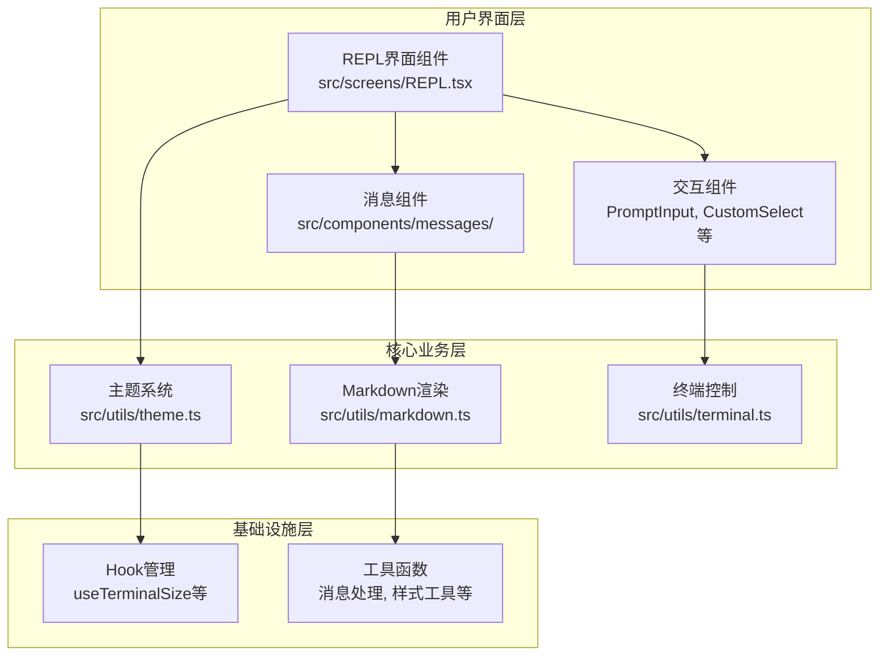
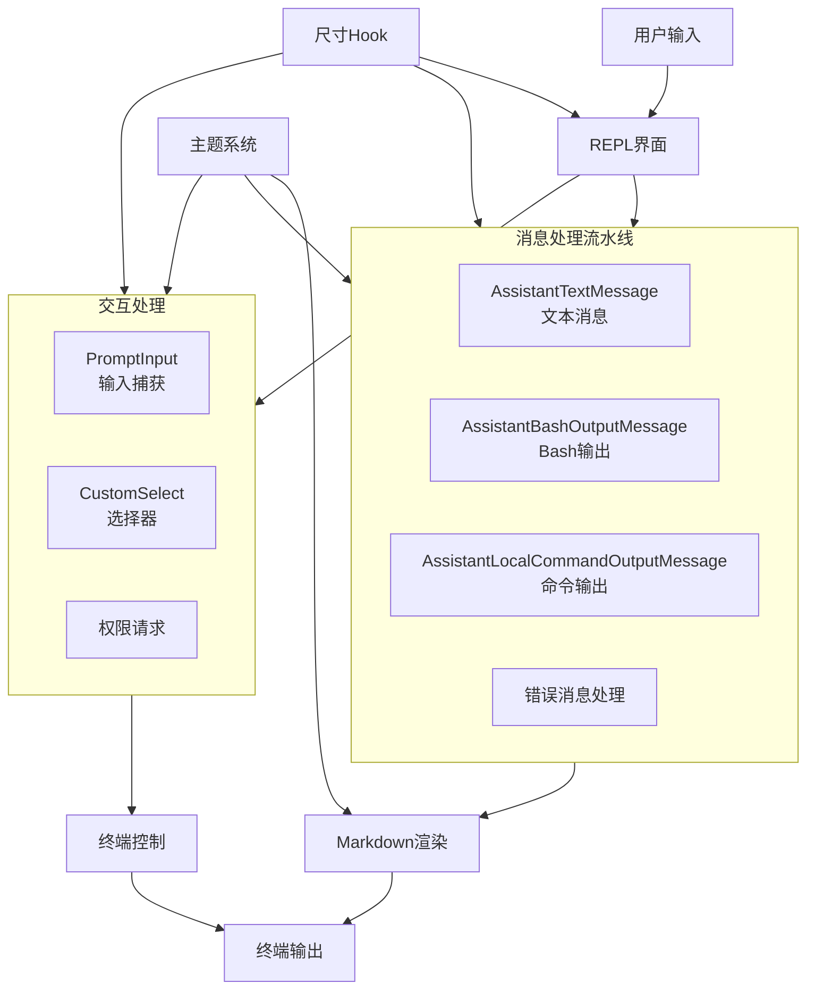
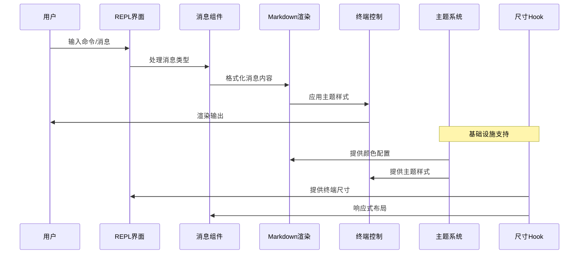
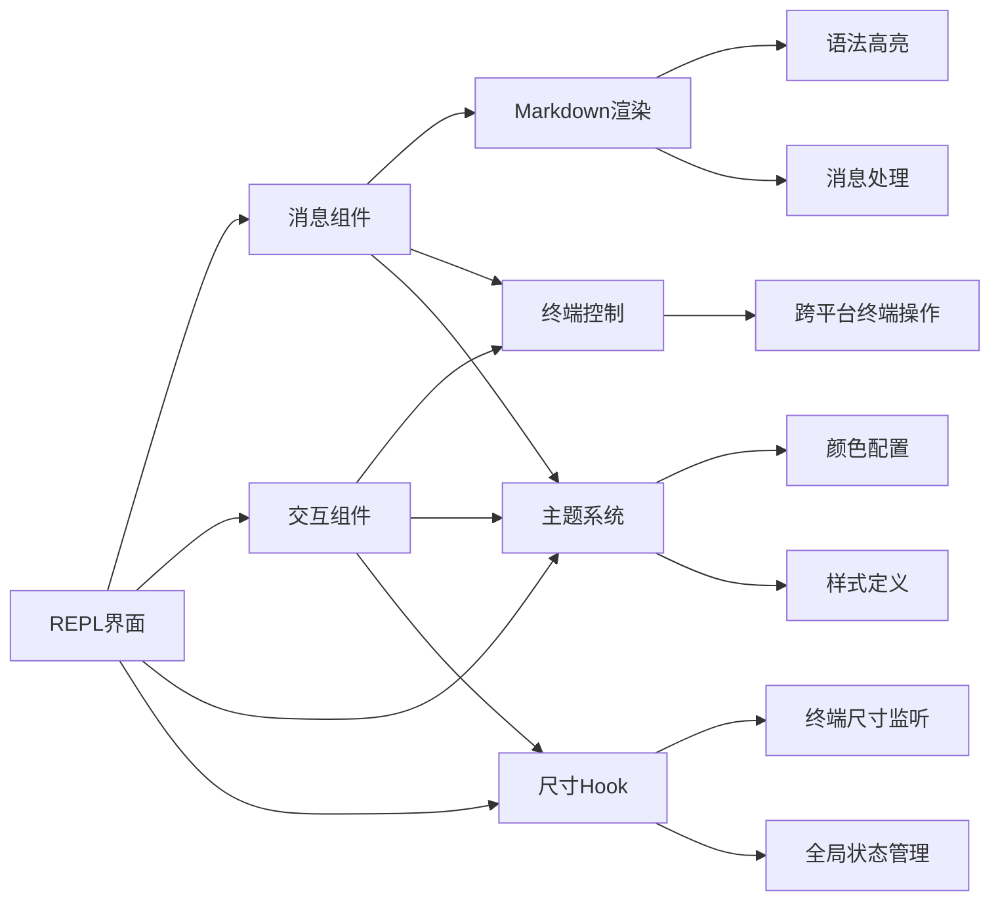
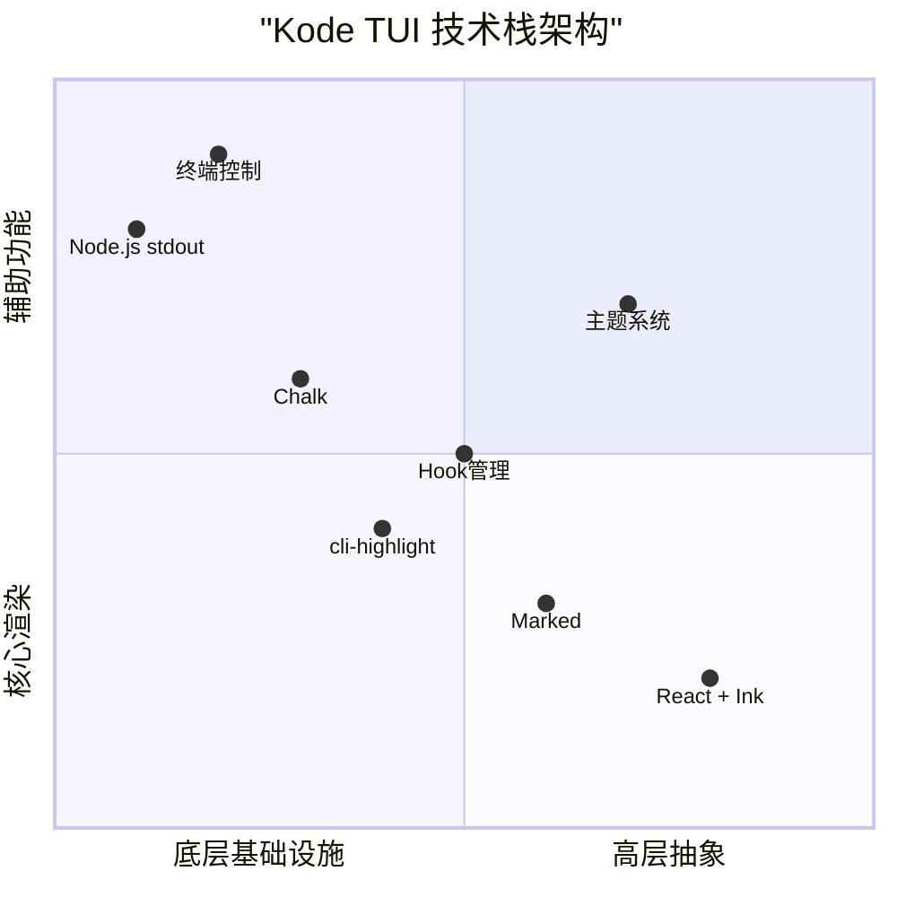
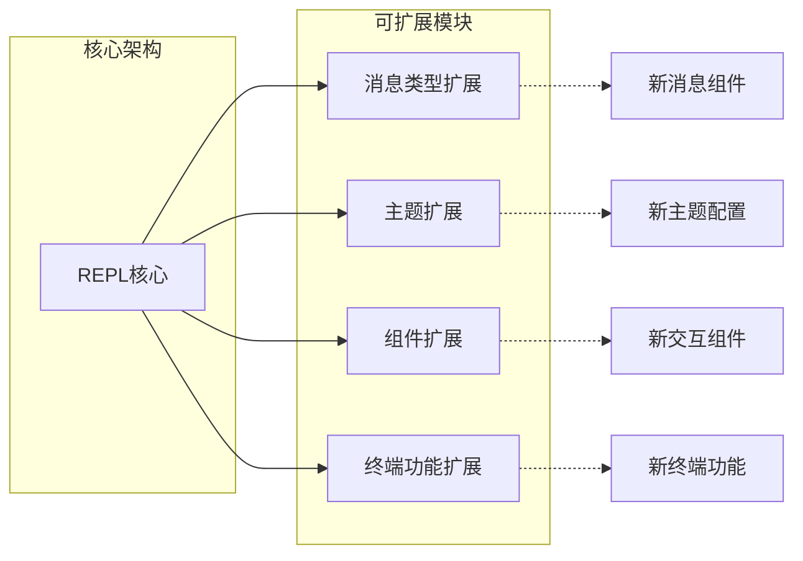

# Kode TUI 架构图

## 整体架构图

```mermaid
graph TB
    subgraph "用户界面层"
        REPL[REPL界面组件<br/>src/screens/REPL.tsx]
        Messages[消息组件<br/>src/components/messages/]
        Interactive[交互组件<br/>PromptInput, CustomSelect等]
    end
    
    subgraph "核心业务层"
        Theme[主题系统<br/>src/utils/theme.ts]
        Markdown[Markdown渲染<br/>src/utils/markdown.ts]
        Terminal[终端控制<br/>src/utils/terminal.ts]
    end
    
    subgraph "基础设施层"
        Hooks[Hook管理<br/>useTerminalSize等]
        Utils[工具函数<br/>消息处理, 样式工具等]
    end
    
    REPL --> Messages
    REPL --> Interactive
    REPL --> Theme
    Messages --> Markdown
    Interactive --> Terminal
    Theme --> Hooks
    Markdown --> Utils
```

## 组件关系图

```mermaid
flowchart TD
    A[用户输入] --> B[REPL界面]
    B --> C[消息组件]
    B --> D[交互组件]
    
    subgraph C [消息处理流水线]
        C1[AssistantTextMessage<br/>文本消息]
        C2[AssistantBashOutputMessage<br/>Bash输出]
        C3[AssistantLocalCommandOutputMessage<br/>命令输出]
        C4[错误消息处理]
    end
    
    subgraph D [交互处理]
        D1[PromptInput<br/>输入捕获]
        D2[CustomSelect<br/>选择器]
        D3[权限请求]
    end
    
    C --> E[Markdown渲染]
    E --> F[终端输出]
    D --> G[终端控制]
    G --> F
    
    H[主题系统] --> C
    H --> D
    H --> E
    
    I[尺寸Hook] --> B
    I --> C
    I --> D
```

## 数据流架构图

```mermaid
sequenceDiagram
    participant User as 用户
    participant REPL as REPL界面
    participant Messages as 消息组件
    participant Markdown as Markdown渲染
    participant Terminal as 终端控制
    participant Theme as 主题系统
    participant Hooks as 尺寸Hook
    
    User->>REPL: 输入命令/消息
    REPL->>Messages: 处理消息类型
    Messages->>Markdown: 格式化消息内容
    Markdown->>Terminal: 应用主题样式
    Terminal->>User: 渲染输出
    
    Note over Theme, Hooks: 基础设施支持
    Theme->>Markdown: 提供颜色配置
    Theme->>Terminal: 提供主题样式
    Hooks->>REPL: 提供终端尺寸
    Hooks->>Messages: 响应式布局
```

## 模块依赖关系图

```mermaid
graph LR
    A[REPL界面] --> B[消息组件]
    A --> C[交互组件]
    A --> D[主题系统]
    A --> E[尺寸Hook]
    
    B --> F[Markdown渲染]
    B --> G[终端控制]
    B --> D
    
    C --> G
    C --> D
    C --> E
    
    F --> H[语法高亮]
    F --> I[消息处理]
    
    G --> J[跨平台终端操作]
    
    D --> K[颜色配置]
    D --> L[样式定义]
    
    E --> M[终端尺寸监听]
    E --> N[全局状态管理]
```

## 技术栈架构图

```mermaid
quadrantChart
    title "Kode TUI 技术栈架构"
    x-axis "底层基础设施" --> "高层抽象"
    y-axis "核心渲染" --> "辅助功能"
    
    "React + Ink": [0.8, 0.2]
    "Marked": [0.6, 0.3]
    "cli-highlight": [0.4, 0.4]
    "Chalk": [0.3, 0.6]
    "Node.js stdout": [0.1, 0.8]
    "主题系统": [0.7, 0.7]
    "Hook管理": [0.5, 0.5]
    "终端控制": [0.2, 0.9]
```

## 扩展架构图

```mermaid
flowchart LR
    subgraph "核心架构"
        Core[REPL核心]
    end
    
    subgraph "可扩展模块"
        MsgExt[消息类型扩展]
        ThemeExt[主题扩展]
        CompExt[组件扩展]
        TermExt[终端功能扩展]
    end
    
    Core --> MsgExt
    Core --> ThemeExt
    Core --> CompExt
    Core --> TermExt
    
    MsgExt -.-> NewMsg[新消息组件]
    ThemeExt -.-> NewTheme[新主题配置]
    CompExt -.-> NewComp[新交互组件]
    TermExt -.-> NewTerm[新终端功能]
```

这些架构图展示了Kode TUI系统的分层设计、组件关系、数据流和技术栈，体现了其模块化、可扩展和现代化的终端应用架构特点。