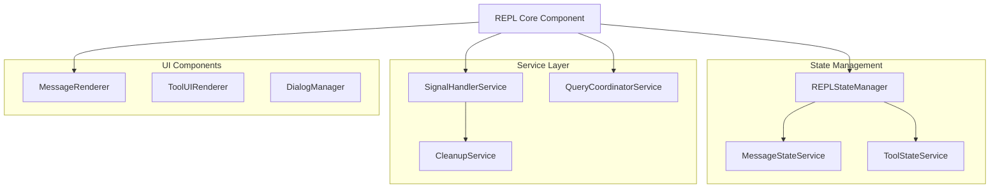

Based on my analysis of the [`src/screens/REPL.tsx`](src/screens/REPL.tsx:1) file, I've identified several key areas for refactoring. The current component is over 900 lines and handles multiple responsibilities, making it difficult to maintain and test.

## Current Architecture Issues

The REPL component currently handles:
- State management for messages, loading, tool usage
- Signal handling and cleanup logic  
- UI rendering and component coordination
- Message processing and query handling
- Tool execution and permission management

## Proposed Refactoring Plan

### 1. Core vs Non-Core Logic Separation

**Core Logic (Keep in REPL.tsx):**
- Main component structure and props
- Primary state management (messages, loading, UI state)
- High-level event handlers (onQuery, onInit)
- Component composition and rendering

**Non-Core Logic (Extract to separate files):**
- Signal handling and cleanup logic
- Message processing utilities
- Tool execution coordination
- Permission request handling
- Cost tracking and dialogs

### 2. Modular Architecture Proposal



### 3. Specific Extraction Targets

#### 3.1 SignalHandlerService (`src/screens/REPL/SignalHandlerService.ts`)
```typescript
// Extract SIGINT handling, cleanup logic, and process management
class SignalHandlerService {
  static setupSignalHandling(
    setToolJSX: SetToolJSXFn,
    setToolUseConfirm: (confirm: ToolUseConfirm | null) => void,
    // ... other dependencies
  ): CleanupFunction
}
```

#### 3.2 REPLStateManager (`src/screens/REPL/REPLStateManager.ts`)
```typescript
// Centralized state management for REPL-specific state
class REPLStateManager {
  private messages: MessageType[]
  private isLoading: boolean
  private toolJSX: React.ReactNode | null
  
  getMessages(): MessageType[]
  setMessages(messages: MessageType[]): void
  // ... other state methods
}
```

#### 3.3 QueryCoordinatorService (`src/screens/REPL/QueryCoordinatorService.ts`)
```typescript
// Handle the complex query logic and message processing
class QueryCoordinatorService {
  async executeQuery(
    messages: MessageType[],
    context: QueryContext
  ): Promise<MessageType[]>
  
  private processToolResults(): void
  private handleKodingMode(): void
}
```

#### 3.4 MessageRenderer (`src/screens/REPL/MessageRenderer.tsx`)
```typescript
// Extract the complex message rendering logic
const MessageRenderer: React.FC<MessageRendererProps> = ({
  messages,
  tools,
  verbose,
  // ... other props
}) => {
  // Extract the 150+ lines of messagesJSX logic
}
```

#### 3.5 ToolUIManager (`src/screens/REPL/ToolUIManager.ts`)
```typescript
// Manage tool UI state and rendering
class ToolUIManager {
  static renderToolJSX(
    toolJSX: React.ReactNode | null,
    toolUseConfirm: ToolUseConfirm | null,
    // ... other UI states
  ): React.ReactNode
}
```

### 4. Interface Definitions

#### 4.1 REPL Core Interface
```typescript
interface REPLCoreProps {
  // Keep only essential props
  commands: Command[]
  tools: Tool[]
  initialPrompt?: string
  // ... minimal props
}

interface REPLInternalAPI {
  onQuery: (messages: MessageType[]) => Promise<void>
  onCancel: () => void
  // ... other essential methods
}
```

#### 4.2 Service Interfaces
```typescript
interface SignalHandler {
  setup(): CleanupFunction
  handleSIGINT(): void
  handleCleanup(): Promise<void>
}

interface StateManager {
  getState(): REPLState
  updateState(updater: (state: REPLState) => REPLState): void
  subscribe(listener: StateListener): UnsubscribeFunction
}
```

### 5. Implementation Strategy

#### Phase 1: Service Extraction
1. Create `SignalHandlerService` with current SIGINT logic
2. Extract state management to `REPLStateManager`
3. Move message processing to `QueryCoordinatorService`

#### Phase 2: UI Component Refactoring
1. Create `MessageRenderer` component
2. Extract tool UI management to `ToolUIManager`
3. Create `DialogManager` for cost dialogs and permissions

#### Phase 3: Core REPL Simplification
1. Reduce REPL.tsx to under 300 lines
2. Implement dependency injection for services
3. Add comprehensive testing

### 6. Benefits of This Approach

1. **Improved Maintainability**: Each service has single responsibility
2. **Better Testability**: Services can be tested in isolation
3. **Enhanced Readability**: Core REPL component becomes focused and clear
4. **Reusability**: Services can be used by other components
5. **Performance**: Better state management and reduced re-renders

### 7. File Structure After Refactoring

```
src/
  screens/
    REPL.tsx                 # ~250 lines (core component)
    REPL.types.ts          # Type definitions
    REPL/
      SignalHandlerService.ts
      QueryCoordinatorService.ts
      REPLStateManager.ts
      MessageRenderer.tsx
      ToolUIRenderer.tsx
      ToolUIManager.ts
      DialogManager.ts
```

This refactoring will significantly improve the codebase structure while maintaining all existing functionality. The core REPL component will be reduced from 900+ lines to around 250 lines, making it much more maintainable.