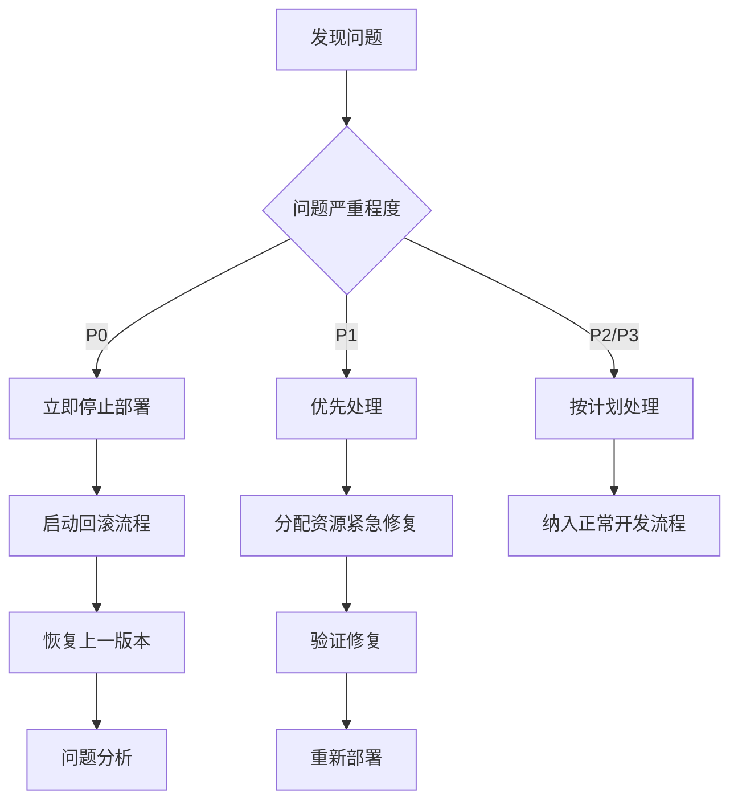

# 风险管理计划

## 风险识别

### 技术风险

| 风险编号 | 风险描述 | 可能性 | 影响程度 | 风险等级 |
|---------|---------|--------|---------|---------|
| TECH-001 | 状态管理重构导致现有功能失效 | 中 | 高 | 高 |
| TECH-002 | 性能优化引入新的性能问题 | 中 | 中 | 中 |
| TECH-003 | 组件拆分导致接口不一致 | 高 | 中 | 中 |
| TECH-004 | 第三方依赖兼容性问题 | 低 | 高 | 中 |
| TECH-005 | 测试覆盖率不足导致回归问题 | 中 | 高 | 高 |

### 项目风险

| 风险编号 | 风险描述 | 可能性 | 影响程度 | 风险等级 |
|---------|---------|--------|---------|---------|
| PROJ-001 | 开发进度延误 | 中 | 中 | 中 |
| PROJ-002 | 资源分配不足 | 低 | 高 | 中 |
| PROJ-003 | 需求变更影响架构 | 低 | 高 | 中 |
| PROJ-004 | 团队协作问题 | 低 | 中 | 低 |

### 业务风险

| 风险编号 | 风险描述 | 可能性 | 影响程度 | 风险等级 |
|---------|---------|--------|---------|---------|
| BUSI-001 | 用户体验下降 | 中 | 高 | 高 |
| BUSI-002 | 生产环境稳定性问题 | 低 | 极高 | 高 |
| BUSI-003 | 数据丢失或损坏 | 低 | 极高 | 高 |

## 风险分析

### 高风险（需要立即处理）

1. **TECH-001: 状态管理重构导致现有功能失效**
   - 根本原因: 状态管理是核心功能，重构影响面广
   - 影响: 可能导致整个REPL功能不可用
   - 触发条件: 状态管理接口变更或实现错误

2. **TECH-005: 测试覆盖率不足导致回归问题**
   - 根本原因: 现有测试用例可能无法覆盖所有场景
   - 影响: 重构后出现未发现的回归问题
   - 触发条件: 复杂的状态交互或边界条件

3. **BUSI-001: 用户体验下降**
   - 根本原因: 性能优化可能引入新的延迟或卡顿
   - 影响: 用户满意度降低，产品竞争力下降
   - 触发条件: 渲染性能下降或输入响应变慢

### 中风险（需要监控和处理）

1. **TECH-002: 性能优化引入新的性能问题**
2. **TECH-003: 组件拆分导致接口不一致**
3. **PROJ-001: 开发进度延误**

### 低风险（需要关注）

1. **TECH-004: 第三方依赖兼容性问题**
2. **PROJ-002: 资源分配不足**
3. **PROJ-004: 团队协作问题**

## 风险应对策略

### 规避策略（针对高风险）

1. **渐进式重构**
   - 分阶段实施，每个阶段都可独立测试和回滚
   - 保持接口兼容性直到重构完成

2. **全面测试覆盖**
   - 增加单元测试覆盖率至90%以上
   - 实施集成测试和E2E测试
   - 建立性能基准测试

3. **代码审查和质量门禁**
   - 严格的代码审查流程
   - 自动化代码质量检查
   - 性能指标门禁

### 减轻策略（针对中风险）

1. **监控和预警**
   - 实施实时性能监控
   - 设置性能阈值预警
   - 定期进行压力测试

2. **文档和培训**
   - 完善技术文档
   - 团队技术培训
   - 知识共享会议

3. **备份和回滚方案**
   - 代码版本控制
   - 数据库备份
   - 快速回滚流程

### 接受策略（针对低风险）

1. **风险接受**
   - 对于低概率低影响风险，选择接受
   - 定期重新评估风险等级

2. **应急计划**
   - 制定应急预案
   - 准备应急资源

## 风险监控

### 监控指标

| 指标类别 | 具体指标 | 监控频率 | 预警阈值 |
|---------|---------|---------|---------|
| 性能指标 | 输入响应时间 | 实时 | > 100ms |
| 性能指标 | 内存使用 | 每小时 | > 500MB |
| 性能指标 | 帧率 | 实时 | < 30FPS |
| 质量指标 | 测试通过率 | 每次提交 | < 95% |
| 质量指标 | 代码覆盖率 | 每日 | < 80% |
| 进度指标 | 任务完成率 | 每日 | < 计划80% |

### 监控工具

1. **性能监控**
   - Chrome DevTools Performance面板
   - React DevTools Profiler
   - 自定义性能指标收集

2. **质量监控**
   - Jest测试覆盖率报告
   - ESLint代码质量检查
   - SonarQube代码分析

3. **进度监控**
   - JIRA任务看板
   - GitHub Projects
   - 每日站会进度同步

## 应急响应

### 应急流程

### 沟通计划

| 风险等级 | 报告对象 | 报告频率 | 沟通方式 |
|---------|---------|---------|---------|
| 高风险 | 项目总监、技术总监 | 立即 | 紧急会议、电话 |
| 中风险 | 项目经理、技术负责人 | 每日 | 每日站会、邮件 |
| 低风险 | 开发团队 | 每周 | 周报、团队会议 |

## 风险责任人

### 技术风险责任人
- **技术总监**: 张工
- **职责**: 技术方案评审、关键技术决策、风险应对
- **联系方式**: zhangsan@example.com

### 项目风险责任人
- **项目经理**: 李工
- **职责**: 进度监控、资源协调、沟通管理
- **联系方式**: lisi@example.com

### 质量风险责任人
- **QA负责人**: 王工
- **职责**: 测试计划、质量监控、问题跟踪
- **联系方式**: wangwu@example.com

## 风险回顾

### 定期回顾

1. **每周风险回顾会议**
   - 时间: 每周五下午3点
   - 参与人: 所有风险责任人
   - 内容: 回顾本周风险情况，调整风险等级和对策

2. **每月风险评估报告**
   - 内容: 风险趋势分析、应对效果评估、新风险识别
   - 分发: 项目相关所有人员

### 风险日志

| 日期 | 风险编号 | 风险描述 | 处理措施 | 处理结果 | 责任人 |
|------|---------|---------|---------|---------|--------|
| 2024-01-15 | TECH-001 | 状态管理重构风险 | 制定渐进式重构计划 | 进行中 | 张工 |
| 2024-01-15 | TECH-005 | 测试覆盖率风险 | 增加测试用例 | 已完成 | 王工 |

## 附录

### 相关文档

- [重构执行计划](./输入框刷新机制重构执行计划.md)
- [技术实现细节](./技术实现细节.md)
- [测试验证计划](./测试验证计划.md)
- [应急预案](./应急预案.md)

### 更新记录

| 版本 | 日期 | 修改内容 | 修改人 |
|------|------|---------|--------|
| v1.0 | 2024-01-15 | 创建风险管理计划 | 风险管理组 |
| v1.1 | 2024-01-16 | 更新风险识别和分析 | 张工 |

---

*本文档将定期更新，反映最新的风险状况和管理措施*