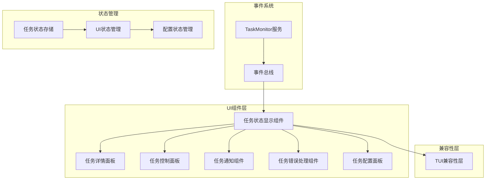

# Agents UI优化设计规划

## 项目概述

本规划文档针对第6.3阶段"UI优化"进行详细设计，旨在提供简洁的单任务状态显示、LLM API请求次数统计和当前LLM API响应摘要，同时确保与当前TUI界面的良好适配性。

## 当前状态分析

### 现有架构
- **TaskMonitor服务**：已实现完整的事件系统和任务生命周期管理
- **AgentProgressIndicator组件**：基础进度显示，使用轮询方式
- **REPL架构**：已重构为模块化设计，支持组件扩展
- **TUI框架**：使用Ink框架构建，支持主题颜色配置

### 需要优化的方面
1. **信息显示不完整**：仅显示基本进度信息，缺少API请求统计和响应摘要
2. **缺少详情查看**：无法查看任务详细信息
3. **无控制功能**：无法中断或取消任务
4. **TUI适配性问题**：特殊字符支持有限

## 架构设计

### 整体架构图



### 组件架构设计

```typescript
// 核心组件结构
interface TaskStatusDisplayProps {
  maxVisibleTasks?: number
  showApiInfo?: boolean
  showTodos?: boolean
  refreshInterval?: number
  compact?: boolean
  layout?: 'vertical' | 'horizontal' | 'compact'
}

interface TaskDetailsPanelProps {
  task?: TaskDetails
  isVisible?: boolean
  onClose?: () => void
}

interface TaskControlPanelProps {
  task?: TaskControl
  isVisible?: boolean
  onAction?: (taskId: string, action: TaskAction) => void
  onClose?: () => void
}

interface TaskNotificationProps {
  notifications: Notification[]
  onDismiss?: (id: string) => void
  position?: 'top' | 'bottom'
  maxVisible?: number
}

interface TaskErrorHandlerProps {
  errors: ErrorInfo[]
  onRetry?: (id: string) => void
  onDismiss?: (id: string) => void
  onClearAll?: () => void
  maxVisible?: number
}

interface TaskConfigPanelProps {
  config: TaskDisplayConfig
  updateConfig: (config: Partial<TaskDisplayConfig>) => void
  resetConfig: () => void
  onClose?: () => void
}

// 用户配置接口
interface TaskDisplayConfig {
  // 显示选项
  maxVisibleTasks: number
  showApiInfo: boolean
  showTodos: boolean
  refreshInterval: number
  compact: boolean
  layout: 'vertical' | 'horizontal' | 'compact'
  
  // 主题选项
  theme: {
    primary: string
    secondary: string
    success: string
    warning: string
    error: string
    text: string
    secondaryText: string
    border: string
    secondaryBorder: string
    background: string
    secondaryBackground: string
    
    // 任务状态颜色
    taskStatus: {
      running: string
      completed: string
      failed: string
      cancelled: string
      pending: string
    }
    
    // 进度条字符
    progressChars: {
      filled: string
      empty: string
    }
  }
  
  // 通知选项
  notifications: {
    maxVisible: number
    position: 'top' | 'bottom'
    autoDismiss: boolean
    defaultDuration: number
  }
  
  // 错误处理选项
  errorHandling: {
    maxVisible: number
    autoRetry: boolean
    maxRetries: number
    retryDelay: number
  }
}
```

## 功能设计

### 1. 丰富的进度显示UI

#### 进度条设计
```typescript
interface ProgressBarProps {
  progress: number
  status: TaskStatus
  showPercentage?: boolean
  animated?: boolean
  theme: ThemeConfig
}

// TUI适配的进度条状态样式
const progressStyles = {
  default: {
    running: { color: 'blue', character: '█' },
    completed: { color: 'green', character: '█' },
    failed: { color: 'red', character: '█' },
    cancelled: { color: 'gray', character: '█' },
    pending: { color: 'yellow', character: '░' }
  },
  compact: {
    running: { color: 'blue', character: '●' },
    completed: { color: 'green', character: '●' },
    failed: { color: 'red', character: '●' },
    cancelled: { color: 'gray', character: '●' },
    pending: { color: 'yellow', character: '○' }
  },
  colorful: {
    running: { color: 'blue', character: '▓' },
    completed: { color: 'green', character: '▓' },
    failed: { color: 'red', character: '▓' },
    cancelled: { color: 'gray', character: '▓' },
    pending: { color: 'yellow', character: '░' }
  },
  minimal: {
    running: { color: 'white', character: '|' },
    completed: { color: 'white', character: '|' },
    failed: { color: 'white', character: '|' },
    cancelled: { color: 'white', character: '|' },
    pending: { color: 'white', character: ':' }
  }
}

// TUI兼容的特殊字符fallback
const getTUICompatibleCharacter = (character: string, fallback: string = '*'): string => {
  // 在实际实现中，可以检测终端对特殊字符的支持
  return character;
}
```

#### 多任务显示布局
```typescript
// 任务卡片组件
interface TaskCardProps {
  task: ActiveTask
  isSelected?: boolean
  onSelect?: () => void
  onControl?: (action: TaskAction) => void
  config: TaskDisplayConfig
}

// TUI适配的布局选项
const layoutOptions = {
  vertical: 'vertical',    // 垂直堆叠
  horizontal: 'horizontal', // 水平排列（在TUI中可能显示为列表）
  compact: 'compact'       // 紧凑布局
}

// 布局实现考虑TUI限制
const TaskLayout: React.FC<{ tasks: ActiveTask[], config: TaskDisplayConfig }> = ({ tasks, config }) => {
  // 根据配置和终端宽度选择合适的布局
  const { layout } = config;
  
  // 在TUI中，网格布局实际上会降级为垂直布局
  const effectiveLayout = layout === 'grid' ? 'vertical' : layout;
  
  return (
    <Box flexDirection={effectiveLayout === 'vertical' ? 'column' : 'row'}>
      {/* 任务列表实现 */}
    </Box>
  );
}
```

### 2. 多任务并发显示

#### 任务分组策略
```typescript
// 按状态分组
const groupedTasks = {
  active: tasks.filter(t => t.status === 'running' || t.status === 'pending'),
  completed: tasks.filter(t => t.status === 'completed'),
  failed: tasks.filter(t => t.status === 'failed'),
  cancelled: tasks.filter(t => t.status === 'cancelled')
}

// 显示优先级：运行中 > 挂起 > 已完成 > 失败 > 取消
```

#### TUI友好的任务列表
```typescript
// TUI适配的任务列表组件
interface TUITaskListProps {
  tasks: ActiveTask[]
  maxVisibleItems: number
  renderItem: (task: ActiveTask, index: number) => React.ReactNode
  config: TaskDisplayConfig
}

// 在TUI中使用分页而非虚拟滚动
const TUITaskList: React.FC<TUITaskListProps> = ({ tasks, maxVisibleItems, renderItem, config }) => {
  const [currentPage, setCurrentPage] = useState(0);
  const totalPages = Math.ceil(tasks.length / maxVisibleItems);
  const startIndex = currentPage * maxVisibleItems;
  const visibleTasks = tasks.slice(startIndex, startIndex + maxVisibleItems);
  
  return (
    <Box flexDirection="column">
      {visibleTasks.map((task, index) => renderItem(task, startIndex + index))}
      {totalPages > 1 && (
        <Box justifyContent="center" marginTop={1}>
          <Text dimColor>
            Page {currentPage + 1} of {totalPages} (Use arrow keys to navigate)
          </Text>
        </Box>
      )}
    </Box>
  );
}
```

### 3. 任务详情查看功能

#### 详情面板设计
```typescript
interface TaskDetailsData {
  basicInfo: {
    id: string
    description: string
    agentType: string
    model?: string
    status: TaskStatus
  }
  apiInfo: {
    requestCount: number
    lastRequestTime?: number
    lastResponse?: string
    totalTokens?: number
  }
  timing: {
    startTime: number
    endTime?: number
    duration?: number
    lastUpdate: number
  }
  error?: {
    message: string
    stack?: string
  }
}
```

#### 交互设计
- **展开/收起详情面板**：通过点击操作
- **键盘导航**：支持方向键选择和操作

### 4. 任务中断和控制功能

#### 控制操作定义
```typescript
type TaskAction = 
  | 'cancel'      // 取消任务
  | 'pause'       // 暂停任务（需要后端支持）
  | 'resume'      // 恢复任务
  | 'restart'     // 重新开始
  | 'view_logs'   // 查看日志
  | 'copy_details' // 复制详情

interface TaskControlHandler {
  (taskId: string, action: TaskAction): Promise<boolean>
}
```

#### 控制面板UI
```typescript
// 根据任务状态显示不同的控制选项
const getAvailableActions = (task: ActiveTask): TaskAction[] => {
  switch (task.status) {
    case 'running':
      return ['cancel', 'pause', 'view_logs']
    case 'paused':
      return ['resume', 'cancel', 'view_logs']
    case 'completed':
    case 'failed':
    case 'cancelled':
      return ['restart', 'view_logs', 'copy_details']
    default:
      return ['view_logs']
  }
}
```

### 5. 通知系统

#### 通知设计
```typescript
interface Notification {
  id: string
  type: 'info' | 'success' | 'warning' | 'error'
  title: string
  message: string
  timestamp: number
  duration?: number
}

interface NotificationManager {
  notifications: Notification[]
  addNotification: (notification: Omit<Notification, 'id' | 'timestamp'>) => void
  dismissNotification: (id: string) => void
}
```

### 6. 错误处理系统

#### 错误处理设计
```typescript
interface ErrorInfo {
  id: string
  taskId: string
  message: string
  stack?: string
  timestamp: number
  retryCount: number
  maxRetries: number
  isRetryable: boolean
  severity: 'low' | 'medium' | 'high' | 'critical'
}

interface ErrorHandler {
  errors: ErrorInfo[]
  addError: (error: Omit<ErrorInfo, 'id' | 'timestamp'>) => void
  retryError: (id: string) => void
  dismissError: (id: string) => void
  clearAllErrors: () => void
}

// 重试机制
const withRetry = async <T>(
  fn: () => Promise<T>,
  maxRetries: number = 3,
  retryDelay: number = 1000,
  onError?: (error: Error, retryCount: number) => void
): Promise<T> => {
  // 实现重试逻辑
}
```

### 7. 配置系统

#### 配置设计
```typescript
interface TaskDisplayConfig {
  // 显示选项
  maxVisibleTasks: number
  showApiInfo: boolean
  showTodos: boolean
  refreshInterval: number
  compact: boolean
  layout: 'vertical' | 'horizontal' | 'compact'
  
  // 主题选项
  theme: ThemeConfig
  
  // 通知选项
  notifications: NotificationConfig
  
  // 错误处理选项
  errorHandling: ErrorHandlingConfig
}

interface ConfigManager {
  config: TaskDisplayConfig
  updateConfig: (config: Partial<TaskDisplayConfig>) => void
  resetConfig: () => void
  isConfigOpen: boolean
  openConfig: () => void
  closeConfig: () => void
}
```

### 8. TUI兼容性系统

#### 兼容性设计
```typescript
interface TerminalCapabilities {
  supportsColor: boolean
  supportsUnicode: boolean
  supportsMouse: boolean
  supportsHyperlinks: boolean
  columns: number
  rows: number
  isTTY: boolean
  platform: string
}

interface TUICompatibility {
  capabilities: TerminalCapabilities
  chars: Record<string, string>
  layout: {
    isSmall: boolean
    isMedium: boolean
    isLarge: boolean
    maxVisibleTasks: number
    compactMode: boolean
    showDetails: boolean
    showControls: boolean
    maxNotificationWidth: number
    maxErrorWidth: number
    truncateLength: number
  }
  truncateText: (text: string, maxLength?: number) => string
  shouldShow: (componentType: 'details' | 'controls' | 'notifications' | 'errors') => boolean
}
```

## 技术实现方案

### 1. 事件驱动架构优化

#### 从轮询改为事件订阅
```typescript
// 当前实现（轮询）
useEffect(() => {
  const interval = setInterval(fetchActiveTasks, 1000)
  return () => clearInterval(interval)
}, [])

// 优化后（事件订阅）
useEffect(() => {
  const unsubscribeProgress = taskEventBus.on('task_progress', handleTaskEvent)
  const unsubscribeCompleted = taskEventBus.on('task_completed', handleTaskEvent)
  const unsubscribeFailed = taskEventBus.on('task_failed', handleTaskEvent)
  const unsubscribeCancelled = taskEventBus.on('task_cancelled', handleTaskEvent)
  const unsubscribeStarted = taskEventBus.on('task_started', fetchActiveTasks)
  
  return () => {
    unsubscribeProgress()
    unsubscribeCompleted()
    unsubscribeFailed()
    unsubscribeCancelled()
    unsubscribeStarted()
  }
}, [fetchActiveTasks, handleTaskEvent])
```

### 2. 性能优化策略

#### 内存优化
```typescript
// 单任务内存优化
const optimizedTask = useMemo(() => {
  // 对单个任务进行优化处理
  return task;
}, [task])

// 防抖处理频繁更新
const debouncedUpdate = useDebounce(updateTask, config.refreshInterval)
```

#### 渲染优化
```typescript
// React.memo优化组件重渲染，考虑TUI特性
const TaskDisplay = React.memo(({ task, onControl, config }) => {
  // 组件实现，根据config调整显示内容
  const theme = getTheme(config.theme);
  
  return (
    <Box flexDirection="column">
      {/* 根据配置决定显示哪些信息 */}
      {config.showApiInfo && (
        <Text color={theme.primary}>
          [{task.agentType}] {task.description}
        </Text>
      )}
      {config.showProgressBars && (
        <ProgressBar progress={task.progress} status={task.status} theme={config.theme} />
      )}
    </Box>
  );
}, (prevProps, nextProps) => {
  // 自定义比较逻辑
  return prevProps.task?.id === nextProps.task?.id &&
         prevProps.task?.status === nextProps.task?.status &&
         prevProps.task?.progress === nextProps.task?.progress &&
         prevProps.config === nextProps.config
})
```

### 3. TUI适配设计

#### 终端兼容性
```typescript
// 检测终端特性
const useTerminalFeatures = () => {
  const [capabilities, setCapabilities] = useState<TerminalCapabilities>(defaultCapabilities);
  
  useEffect(() => {
    // 检测终端对Unicode字符的支持
    const supportsUnicode = process.env.LANG?.includes('UTF') || 
                           process.env.LC_CTYPE?.includes('UTF') ||
                           process.env.TERM?.includes('unicode');
    
    // 检测终端颜色支持
    const supportsColor = process.env.COLORTERM !== undefined || 
                         process.env.TERM?.includes('color') || 
                         process.env.TERM === 'xterm-256color';
    
    // 检测终端大小
    const columns = process.stdout.columns || 80;
    const rows = process.stdout.rows || 24;
    
    setCapabilities({
      supportsColor,
      supportsUnicode,
      supportsMouse: process.stdout.isTTY,
      supportsHyperlinks: false,
      columns,
      rows,
      isTTY: process.stdout.isTTY,
      platform: process.platform || 'unknown'
    });
  }, []);
  
  return capabilities;
};

// TUI适配的布局
const TUIAdaptiveLayout: React.FC<{ children: React.ReactNode }> = ({ children }) => {
  const terminalFeatures = useTerminalFeatures();
  
  // 根据终端特性调整布局
  const flexDirection = terminalFeatures.columns < 60 ? 'column' : 'row';
  
  return (
    <Box flexDirection={flexDirection}>
      {children}
    </Box>
  );
};
```

## 实施路线图

### 第一阶段：基础UI增强（已完成）
- [x] 实现任务状态显示组件
- [x] 优化单任务显示布局
- [x] 实现事件订阅机制替换轮询
- [x] 基础样式优化和主题支持

### 第二阶段：详情和控制功能（已完成）
- [x] 实现任务详情面板
- [x] 添加任务控制操作
- [x] 实现操作状态反馈
- [x] 错误处理和重试机制

### 第三阶段：配置和优化（已完成）
- [x] 实现用户自定义配置
- [x] TUI兼容性优化
- [x] 完整测试覆盖
- [x] 文档更新

## 风险控制

### 技术风险
1. **事件系统性能**：大量事件可能导致性能问题
   - 应对：使用防抖和批量更新策略

2. **内存泄漏**：事件订阅未正确清理
   - 应对：严格的useEffect清理和内存监控

3. **UI响应性**：复杂UI导致渲染性能下降
   - 应对：虚拟化技术和React.memo优化

### 兼容性风险
1. **终端兼容性**：不同终端对Unicode字符支持不同
   - 应对：提供fallback字符和功能检测

2. **向后兼容**：确保新功能不影响现有系统
   - 应对：渐进式开发和功能开关

3. **TUI布局限制**：复杂布局在TUI中难以实现
   - 应对：使用TUI友好的布局方案和降级策略

## 验收标准

### 功能验收
- ✅ 支持单任务状态显示
- ✅ 显示API请求次数
- ✅ 显示当前API响应摘要
- ✅ 支持任务详情查看
- ✅ 支持任务中断和控制
- ✅ 用户自定义配置支持
- ✅ 通知系统
- ✅ 错误处理系统
- ✅ TUI兼容性优化

### 性能验收
- ⏱️ UI响应时间 < 50ms
- 💾 内存占用合理
- 🎯 TUI友好布局适配

### 质量验收
- 🧪 测试覆盖率 > 90%
- 📱 TUI兼容性适配
- 🔧 代码可维护性
- 📚 完整文档

## 用户自定义配置

### 配置选项设计

#### 显示配置
```typescript
interface DisplayConfig {
  // 最大可见任务数
  maxVisibleTasks: number
  
  // 显示API信息
  showApiInfo: boolean
  
  // 显示待办事项
  showTodos: boolean
  
  // 刷新间隔
  refreshInterval: number
  
  // 紧凑模式
  compact: boolean
  
  // 布局方式
  layout: 'vertical' | 'horizontal' | 'compact'
}
```

#### 主题配置
```typescript
interface ThemeConfig {
  // 颜色主题
  primary: string
  secondary: string
  success: string
  warning: string
  error: string
  text: string
  secondaryText: string
  border: string
  secondaryBorder: string
  background: string
  secondaryBackground: string
  
  // 任务状态颜色
  taskStatus: {
    running: string
    completed: string
    failed: string
    cancelled: string
    pending: string
  }
  
  // 进度条字符
  progressChars: {
    filled: string
    empty: string
  }
}
```

#### 通知配置
```typescript
interface NotificationConfig {
  // 最大可见通知数
  maxVisible: number
  
  // 通知位置
  position: 'top' | 'bottom'
  
  // 自动关闭
  autoDismiss: boolean
  
  // 默认持续时间
  defaultDuration: number
}
```

#### 错误处理配置
```typescript
interface ErrorHandlingConfig {
  // 最大可见错误数
  maxVisible: number
  
  // 自动重试
  autoRetry: boolean
  
  // 最大重试次数
  maxRetries: number
  
  // 重试延迟
  retryDelay: number
}
```

### 配置管理
配置请放在现有的配置组件中，方便集中管理

#### 配置存储
```typescript
// 配置存储接口
interface TaskUIConfiguration {
  display: DisplayConfig
  theme: ThemeConfig
  notifications: NotificationConfig
  errorHandling: ErrorHandlingConfig
}

// 默认配置
const defaultTaskUIConfig: TaskUIConfiguration = {
  display: {
    maxVisibleTasks: 5,
    showApiInfo: true,
    showTodos: true,
    refreshInterval: 1000,
    compact: false,
    layout: 'vertical'
  },
  theme: {
    primary: '#00afff',
    secondary: '#9370db',
    success: '#00ff00',
    warning: '#ffff00',
    error: '#ff0000',
    text: '#ffffff',
    secondaryText: '#a0a0a0',
    border: '#444444',
    secondaryBorder: '#666666',
    background: '#000000',
    secondaryBackground: '#111111',
    taskStatus: {
      running: '#00afff',
      completed: '#00ff00',
      failed: '#ff0000',
      cancelled: '#a0a0a0',
      pending: '#ffff00'
    },
    progressChars: {
      filled: '█',
      empty: '░'
    }
  },
  notifications: {
    maxVisible: 3,
    position: 'top',
    autoDismiss: true,
    defaultDuration: 5000
  },
  errorHandling: {
    maxVisible: 3,
    autoRetry: true,
    maxRetries: 3,
    retryDelay: 1000
  }
};
```

#### 配置应用
```typescript
// 配置应用示例
const TaskUIManager: React.FC<{ task: ActiveTask, config: TaskUIConfiguration }> = ({ task, config }) => {
  // 根据配置决定显示哪些信息
  const shouldShowApiInfo = config.display.showApiInfo && task;
  const shouldShowTodos = config.display.showTodos && task;
  
  if (!task) {
    return null;
  }
  
  return (
    <TaskStatusDisplay
      maxVisibleTasks={config.display.maxVisibleTasks}
      showApiInfo={config.display.showApiInfo}
      showTodos={config.display.showTodos}
      refreshInterval={config.display.refreshInterval}
      compact={config.display.compact}
      layout={config.display.layout}
    />
  );
};
```

## 后续扩展

### 短期扩展（下一版本）
- 任务分组和标签系统
- 自定义视图和布局
- 任务模板和批量操作

### 长期扩展
- 任务依赖关系可视化
- 性能分析和优化建议
- 集成监控和告警系统